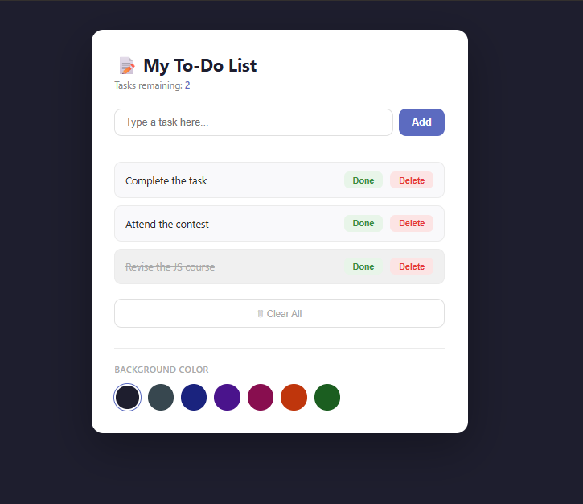

# 📝 JavaScript To-Do List

A simple and interactive To-Do List application built with **HTML**, **CSS**, and **JavaScript**. This project allows users to create, manage, and organize their daily tasks through a clean and responsive interface.

---

## 📌 Features

### Task Requirements
- ➕ Add new tasks
- ✔️ Mark tasks as completed
- 🗑️ Delete tasks
- ✏️ Edit existing tasks
- 📋 Display all tasks dynamically
- 🚫 Prevent empty tasks from being added

---

## 📸 Screenshot



---

## 🛠️ Technologies Used

- HTML5
- CSS3
- JavaScript (ES6)

---

## 📂 Project Structure

```
project-folder/
│
├── index.html
├── style.css
├── script.js
├── README.md
└── Screenshot/
    └── To-Do-List.png
```

---

## 🌐 Live Demo

👉 https://unbrokenlogic.github.io/ASTUSummerBootcamp-Project-2/

---

## 🚀 Quick Start

1. Download or clone the repository.

```bash
git clone https://github.com/UnbrokenLogic/ASTUSUmmerBootcamp-Project-2.git
```

2. Open the project folder.

3. Open `index.html` in your preferred web browser.

No installation or additional packages are required.

---

## 📖 How to Use

1. Type a task into the input field.
2. Click the **Add** button.
3. Click a task to mark it as completed.
4. Click the **Edit** button to modify a task.
5. Click the **Delete** button to remove a task.
6. Refresh the page—your tasks remain saved if Local Storage is enabled.

---

## 💡 Learning Goals

This project helps practice:

- JavaScript DOM manipulation
- Event handling
- Creating and removing HTML elements dynamically
- Working with arrays and objects
- Using Local Storage
- Writing cleaner and more organized JavaScript code

---

## 📄 License

This project is created for educational purposes and is free to use and modify.

---

## 👨‍💻 Author

Created by **Suleyman Dawud** as a JavaScript learning project.
